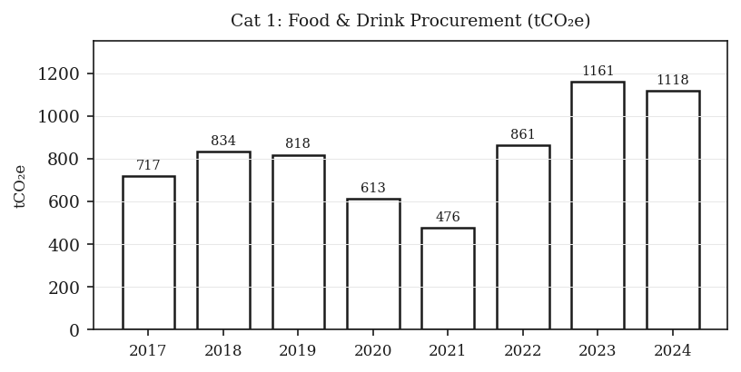
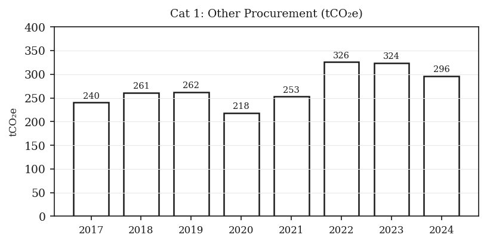
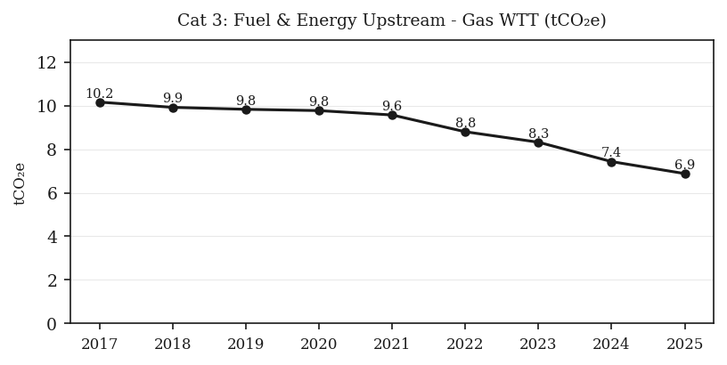
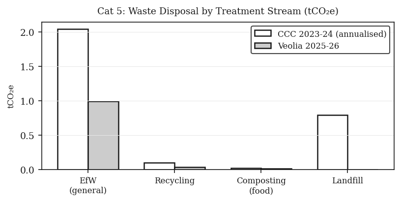
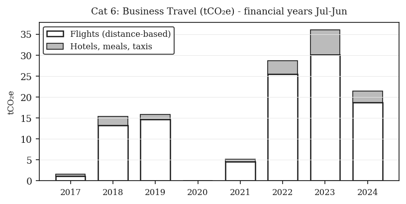
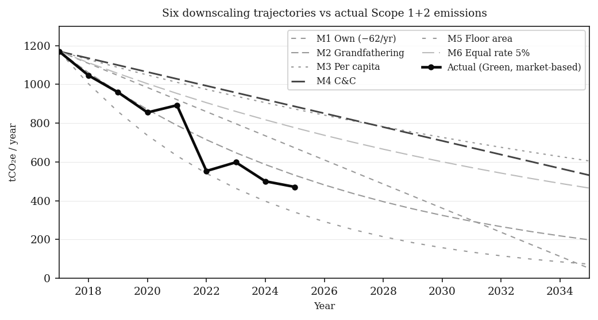
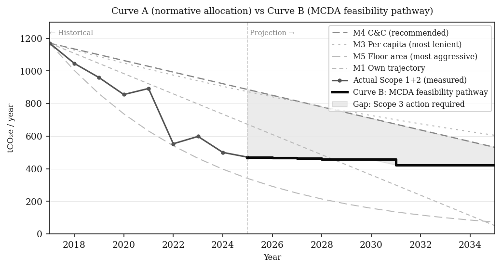

markdown
# Downscaling Paris-aligned carbon budgets to institutional scale

**Research Progress Update - Cambridge Institutional Case Study**

MPhil in Engineering for Sustainable Development, University of Cambridge, 2025-26
Supervisors: Academic supervisors, Centre for Sustainable Development

---

Local authorities in the UK directly control only around 4% of territorial emissions. The remainder is produced by private organisations - colleges, businesses, hospitals - each of which sets carbon targets independently, with no mechanism to ensure those targets aggregate to the city-level remaining carbon budget. This page documents preliminary Scope 3 results from a detailed GHG inventory of a Cambridge college, informed by structured interviews with seven institutional stakeholders.

---

## Scope 3 emissions summary

|
 Category 
|
 GHG Protocol 
|
 Method 
|
 2024 estimate 
|
 Data quality 
|
|
---
|
---
|
---
|
---:
|
---
|
|
 Food and drink procurement 
|
 Cat 1 
|
 Spend-based EEIO (Stage 1) 
|
 1,118 tCO2e 
|
 Low - Stage 2 upgrade needed 
|
|
 Other procurement 
|
 Cat 1 
|
 Spend-based EEIO (Stage 1) 
|
 296 tCO2e 
|
 Medium 
|
|
 Fuel and energy upstream 
|
 Cat 3 
|
 Activity-based (gas WTT) 
|
 7.4 tCO2e 
|
 High 
|
|
 Waste disposal 
|
 Cat 5 
|
 Activity-based (by stream) 
|
 2.9 tCO2e 
|
 High 
|
|
 Business travel - flights 
|
 Cat 6 
|
 Distance-based with RF 
|
 18.7 tCO2e 
|
 Medium - lower bound 
|
|
 Institutional investments 
|
 Cat 15 
|
 Financed emissions (PCAF) 
|
 Pending 
|
 No data yet 
|

> **Note:** Cat 15 (investments) is expected to be the largest single category once data is obtained from the investment manager. At a conservative intensity of 50 tCO2e per £m invested, it would exceed all other categories combined.

---

## Cat 1 - Food and Drink Procurement

**What this covers:** All food, wine, and beverages purchased by the catering department. Calculated using spend-based EEIO (Stage 1): spend in GBP multiplied by sector emission factor (1.82 kgCO2e/GBP for food, SIC 10; 0.84 for beverages, SIC 11) divided by 1,000 equals tCO2e. Stage 2 upgrade to weight-based method requires procurement data by food type - not yet obtained.

|
 Metric 
|
 Value 
|
|
---
|
---
|
|
 Share of total Scope 3 (2024) 
|
 71.8% 
|
|
 2024 estimate 
|
 1,118 tCO2e 
|
|
 EF range: beef vs salad 
|
 approximately 30x difference 
|
|
 Source 
|
 DEFRA/ONS Table 13, SIC 10/11 
|

> *"Weight data by food type is the single most important piece of outstanding data. The EEIO factor averages across all food types - it cannot distinguish a beef-heavy menu from a plant-based one. The same spend produces emissions 30 times higher if it is red meat."*
> 
> Research note: interview with catering representative (data pending)

**Methodological caveat:** Stage 1 figure is illustrative only. Food procurement is the largest single Scope 3 source and also the most uncertain. Should not be reported without Stage 2 upgrade.

---

## Cat 1 - Other Procurement

**What this covers:** Cleaning materials, laundry services, maintenance and repairs, stationery, printing, books, journals and library resources. EEIO factors applied by SIC code: chemicals 1.31 kgCO2e/GBP (SIC 20); repair services 0.62 (SIC 43); paper 0.72 (SIC 17); publishing 0.49 (SIC 58); personal services 0.55 (SIC 96). Source: DEFRA/ONS UK Carbon Footprint supplementary tables, Table 13.

|
 Metric 
|
 Value 
|
|
---
|
---
|
|
 Share of total Scope 3 (2024) 
|
 24.2% 
|
|
 2024 estimate 
|
 296 tCO2e 
|

> *"Building materials, electrical, plumbing - they are all combined under general repairs. The professional fees line covers architect charges, not the buildings cost. So only depreciation is left for Cat 2."*
> 
> Finance representative, interview June 2026

---

## Cat 3 - Fuel and Energy Upstream

**What this covers:** Well-to-Tank (WTT) emissions from extracting, processing and transporting natural gas before it reaches the institution. Formula: gas consumed (kWh) multiplied by 0.03021 kgCO2e/kWh divided by 1,000 equals tCO2e (DEFRA 2025, WTT-fuels tab).

Electricity T&D losses are zero: the institution imports no grid electricity. All electricity is generated on-site by solar PV, confirmed by prior GHG researcher (quarterly meter reports to estates). This was independently verified through meter readings across all buildings.

|
 Metric 
|
 Value 
|
|
---
|
---
|
|
 2025 figure 
|
 6.9 tCO2e (lowest on record) 
|
|
 Reduction 2017-2025 
|
 -32% 
|
|
 Electricity T&D 
|
 0 tCO2e (no grid import) 
|
|
 Source 
|
 DEFRA 2025, WTT-fuels tab, 0.03021 kgCO2e/kWh 
|

> *"Don't take anyone's word for it, including mine. The college hired specialists to verify. The data points represent annual meter readings - lines between them guide the eye and do not represent sub-annual values."*
> 
> Prior GHG researcher, email June 2026

**Note on solar water heating:** Direct solar thermal feeds into the gas boiler system but is not separately metered. Gas meter readings are taken after solar pre-heating, so solar thermal contribution is already implicitly captured in the lower gas figures.

---

## Cat 5 - Waste Disposal

**What this covers:** Solid waste generated in operations and treated by contractor. Two periods calculated: (1) previous contractor, April 2023 to January 2024 (11 months, annualised) - 158 tonnes total, 98% diverted from landfill, 2% to landfill, DEFRA 2024 emission factors; (2) current contractor, July 2025 to June 2026 (12 months) - 123.5 tonnes, 100% diverted from landfill, DEFRA 2025 emission factors. Water/wastewater is Category 3 per DEFRA and excluded from Cat 5.

|
 Metric 
|
 Value 
|
|
---
|
---
|
|
 Reduction between periods 
|
 -64.5% 
|
|
 Landfill diversion (current contractor) 
|
 100% 
|
|
 Landfill EF vs EfW EF 
|
 446 vs 15.6 kgCO2e/tonne - 29x difference 
|
|
 Source 
|
 DEFRA 2024/2025, Waste disposal tab 
|

> *"Not all our waste goes to the same place."*
> 
> Maintenance representative, on waste heat recovery feasibility, MCDA interview June 2026

**Note:** Non-hazardous stream (51.73% of total) assumed to go to Energy from Waste facility - standard UK route but confirmation pending. The 2% landfill fraction under the previous contractor alone accounted for 26.7% of that period's waste emissions despite being only 2% of waste volume - confirming the importance of full landfill diversion.

---

## Cat 6 - Business Travel (Flights)

**What this covers:** Air travel by institutional staff, primarily the development department. Distance-based method: route km multiplied by 2 (return) multiplied by passengers multiplied by 0.19523 kgCO2e/km (long haul, economy, with radiative forcing, DEFRA 2025). Data from transaction-level expense records. Trips identified from transaction descriptions; bundled hotel/flight items interpolated. All figures in financial years (July-June).

|
 Metric 
|
 Value 
|
|
---
|
---
|
|
 Total identified flights 2017-2024 
|
 108 tCO2e 
|
|
 Highest year 
|
 FY2023: 30.1 tCO2e (multiple international campaigns) 
|
|
 COVID year 
|
 FY2020: 0 tCO2e 
|
|
 Source 
|
 DEFRA 2025, Business Travel - Air tab, with radiative forcing 
|

> *"The development department's international alumni programme produced more carbon in the highest year than all other Scope 3 categories combined for that year, except food procurement."*
> 
> Finding from transaction-level expense analysis

**Lower bound:** Several bundled expense items combining flights and hotels were excluded as inseparable. True Cat 6 total is estimated at 2-3 times the identified figure. Central flight booking records from finance are needed to close this gap. All flights assumed economy class - if any bookings were in business class, those emissions would be multiplied by 2.9 (DEFRA business class multiplier).

---

## Downscaling Framework Analysis

Six equity-based frameworks were applied to allocate a Paris-aligned carbon budget to the institution. Starting point: 1,170 tCO2e (2017, market-based Scope 2). Global budget: 400 GtCO2 from 2020 for 1.5 degrees at 67% probability (IPCC AR6 WGI 2021, Table SPM.2). UK share: approximately 3.0 GtCO2 (Tyndall Centre SCATTER). Cambridge city: less than 5 MtCO2 (Kuriakose et al. 2022).

### Six techniques studied

|
 Method 
|
 Equity basis 
|
 Annual reduction 
|
 2024 allocation 
|
 Zero year 
|
|
---
|
---
|
---
|
---:
|
---
|
|
 M1: Own trajectory 
|
 Internal committee target (75% cut by 2031) 
|
 -62 tCO2e/yr (linear) 
|
 684 tCO2e 
|
 311 tCO2e by 2031 
|
|
 M2: Grandfathering 
|
 Historical share of UK budget 
|
 -9.4%/yr (exponential) 
|
 787 tCO2e 
|
 approx 2038 
|
|
 M3: Per capita 
|
 Population share of Cambridge budget 
|
 -3.6%/yr (exponential) 
|
 978 tCO2e 
|
 approx 2072 
|
|
 M4: C&C 
|
 All institutions to zero by 2050 simultaneously 
|
 -35 tCO2e/yr (linear) 
|
 882 tCO2e 
|
 2050 
|
|
 M5: Floor area 
|
 Floor area share of UK non-domestic total 
|
 -14.3%/yr (exponential) 
|
 560 tCO2e 
|
 approx 2031 
|
|
 M6: Equal rate 
|
 Same 5%/yr as UK national trajectory 
|
 -5%/yr (exponential) 
|
 869 tCO2e 
|
 asymptotic 
|

**Key finding:** The choice of framework produces a 75% difference in permissible emissions for the same institution in the same year (per capita 978 vs floor area 560 in 2024). The institution's own committee trajectory sits between grandfathering and C&C. The actual measured emissions (Green line, market-based Scope 2) fall below even the most aggressive framework from 2022, demonstrating that solar investment has effectively resolved the Scope 1+2 challenge.

---

## Curve A vs Curve B: Normative allocation vs feasibility pathway

The MCDA (Simple Additive Weighting, 9 interventions, 4 criteria) produces a priority ordering of decarbonisation interventions. Each intervention is sequenced by MCDA rank subject to doability constraints (interventions with doability score of 1 excluded until barriers resolved), annual capital expenditure limits, and physical sequencing dependencies. The result is a stepped pathway starting from the 2025 measured value (471 tCO2e).

**Curve B - MCDA feasibility pathway:**

|
 Year 
|
 Intervention completed 
|
 Cumulative emissions 
|
|
---
|
---
|
---:
|
|
 2025 
|
 LED lights (35% remaining) 
|
 466 tCO2e 
|
|
 2026 
|
 Sensor lights extension 
|
 462 tCO2e 
|
|
 2027 
|
 Insulation (cavity walls, Year 1) 
|
 459 tCO2e 
|
|
 2028 
|
 Glazing phase 1 
|
 458 tCO2e 
|
|
 2029 
|
 Glazing phase 2 
|
 457 tCO2e 
|
|
 2030 
|
 Heat pumps commissioned 
|
 423 tCO2e 
|
|
 2031+ 
|
 No further feasible interventions identified 
|
 423 tCO2e 
|

**Reading this chart:** Smooth curves are normative allocations (what each equity framework requires). The thick stepped black line is Curve B - what the institution can technically achieve through its own physical interventions given feasibility constraints. The shaded gap from 2030 represents emissions that cannot be reduced through energy efficiency alone and require Scope 3 action - particularly food procurement reform and engagement with the institutional investment portfolio (Cat 15, data pending from investment manager).

---

## References

1. LGA/DECC (2011). Local authorities and climate change. DECC, London.
2. Pan et al. (2017). Environmental Science and Policy, 74, 49-56.
3. IPCC AR6 WGI (2021). The Physical Science Basis. Cambridge University Press.
4. GHG Protocol (2011). Corporate Value Chain Standard. WRI/WBCSD.
5. IPCC AR6 WGI (2021). Table SPM.2 - Remaining carbon budgets.
6. Tyndall Centre / SCATTER (2021). carbonbudget.manchester.ac.uk
7. Kuriakose et al. (2022). Renewable and Sustainable Energy Transition, 2, 100030.
8. Hohne et al. (2014). Climate Policy, 14(1), 122-147.
9. Robiou du Pont et al. (2017). Nature Climate Change, 7, 38-43.
10. Meyer (2000). Contraction and Convergence. Green Books.
11. MHCLG (2021). Non-Domestic NEED Data Tables. gov.uk
12. Carbon Trust GPG155; US DOE EERE (2023); Penasco et al. (2022) Energy Economics, 112.
13. IEA (2021). Net Zero by 2050. iea.org
14. DEFRA (2025). Greenhouse gas reporting: conversion factors. gov.uk/government/publications/greenhouse-gas-reporting-conversion-factors-2025

---

## Abbreviations

|
 Abbreviation 
|
 Full term 
|
|
---
|
---
|
|
 C&C 
|
 Contraction and Convergence 
|
|
 CO2e 
|
 Carbon dioxide equivalent 
|
|
 EEIO 
|
 Environmentally Extended Input-Output analysis 
|
|
 EF 
|
 Emission factor 
|
|
 EfW 
|
 Energy from Waste 
|
|
 GF 
|
 Grandfathering 
|
|
 GHG 
|
 Greenhouse gas 
|
|
 IPCC 
|
 Intergovernmental Panel on Climate Change 
|
|
 MCDA 
|
 Multi-Criteria Decision Analysis 
|
|
 PCAF 
|
 Partnership for Carbon Accounting Financials 
|
|
 RF 
|
 Radiative forcing 
|
|
 SAW 
|
 Simple Additive Weighting 
|
|
 SIC 
|
 Standard Industrial Classification 
|
|
 tCO2e 
|
 Tonnes of carbon dioxide equivalent 
|
|
 WTT 
|
 Well-to-Tank 
|

---

*More updates to follow.*

*MPhil Engineering for Sustainable Development, University of Cambridge, 2025-26*
